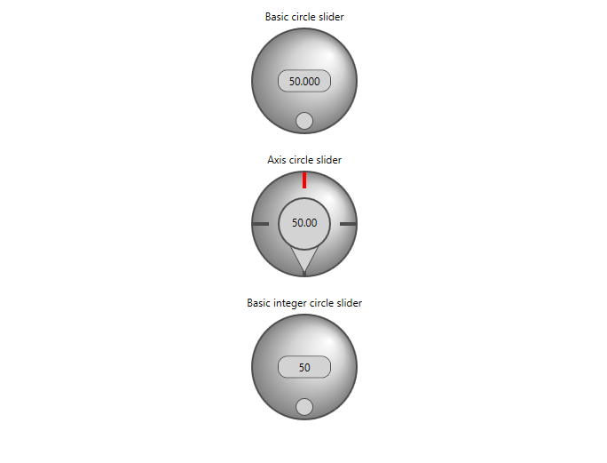

# Circle Sliders

Wpf UI circle slider controls to set numeric value. The library contains three types: 
- **BasicCircleSlider** - Value is double type, you can set min value and max value
```
<slider:BasicCircleSlider MinValue="0" MaxValue="100" Value="{Binding DoubleValue}"/>
```
- **BasicIntCircleSlider** - Value is integer type, you can set min value and max value
```
<slider:BasicIntCircleSlider MinValue="0" MaxValue="100" Value="{Binding IntValue}"/>
```
- **AxisCircleSlider** - Value is double type, you can set min value and max value
```
<slider:AxisCircleSlider MinValue="0" MaxValue="100" Value="{Binding DoubleValue}"/>
```


